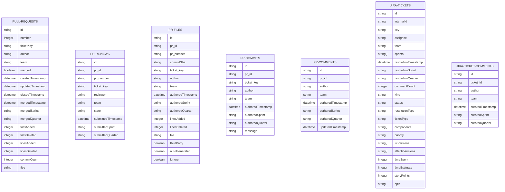
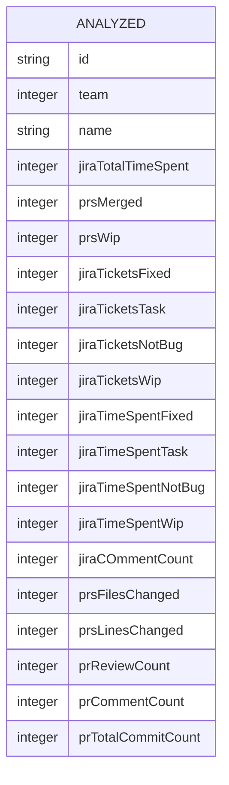

# Measuring Productivity and Performance of Software Engineering Teams - Part 2

${toc}

## Overview

In a previous [post](https://manastalukdar.github.io/blog/2019/05/04/measuring-productivity-performance-software-engineering-teams/) we discussed one methodology for measuring productivity and performance of software engineering teams. This post expands on it by outlining a thorough framework with (weighted) metrics from multiple different sources that software engineers use on a daily basis, to present a much more holistic picture.

## Motivation

The efficiency and effectiveness of individual engineers and of engineering teams is both subjective and objective. In most cases both views should align. Over the years I have developed a framework that gathers data and provides the objective view in an easily consumable and actionable format. This framework also provides a mechanism to align and reconcile the data driven view with the subjective view.

The metrics outlined in this framework provide a comprehensive view of the productivity and performance of software engineering teams. By tracking metrics such as pull requests, tickets, time spent, and engagement in internal forums, organizations can gain valuable insights into the efficiency and effectiveness of their teams. This framework can be used for continuous assessment and feedback to engineers and teams, and not just for performance review cycles. It is important to note that while these metrics are useful, they should be interpreted and utilized with caution, taking into account the unique context and goals of each team and each engineer. They should also not be used to blindly draw any inferences.

## Metrics

### Pull Requests

- Merged count: Total number of PRs merged (and closed). This may be further filtered based on whether the merge commit has made it into a mainline branch or not.
- For merged PRs
  - Commit count
  - lines changed count
    - added
    - removed
  - files changed count
    - added
    - removed
- In Progress count: Total number of open PRs that were created within a configurable time range (usually 2-4 weeks) but has not been merged (and closed) yet.
- Reviewed count: Total number of PRs reviewed. This is as explicit reviewer and not simply a case of someone making a comment counting as a reviewer.
- Comment count: Total number of PR comments.

### Tickets

- For tickets of type `Bug`, `New Feature`, `Improvement`
  - For tickets closed with status of `Fixed` or `Done`.
    - Total count
    - Total logged time
  - For tickets closed with status of `No longer applicable`.
    - Total count
    - Total logged time
  - For tickets with “in progress” status (i.e., status is neither `Open` not `Closed`)
    - Total count
    - Total logged time
- For tickets of type `Bug` closed with status of `Not a Bug` or `Won't Fix`.
  - Total count
  - Total logged time
- For tickets of type `Task`
  - For tickets closed with status of `Fixed` or `Done`.
    - Total count
    - Total logged time
  - For tickets with “in progress” status (i.e., status is neither `Open` not `Closed`)
    - Total count
    - Total logged time

### Tickets Comments

- Count of comments made under tickets.

### Sprint Completion

Sprint completion may be measured using one or more of the following mechanisms.

1. Percentage of `Closed` tickets relative to total tickets that were committed for the sprint during sprint planning. An important caveat is that this assumes some sort of averaging out in the weight of tickets (typically defined by story points and in some cases time estimation). When time estimation is used, I would recommend that engineers are encouraged to not have a single ticket be estimated for more than 2 days’ worth of work. With story points as well, same idea applies. If that does not happen to be the case, they should break it down. Otherwise, it is quite conceivable that one engineer might close 10 small tickets while someone else might only close two, even though in the latter case perhaps that involved lot more work and maybe was of higher impact.
2. Percentage of total story points for `Closed` tickets relative to total story points of all committed tickets for the sprint.
3. Percentage of the sum of original estimate (in time) for `Closed` tickets relative to expected time available in the sprint minus any planned or unplanned time-off. Expected time available can be set to 80% of 8hrs * 10days.

### Engagement in internal forums

- Slack, Teams, etc.
  - Post count
  - Replies count
- Community forum
  - Post count
  - Replies count
  - Count of replies marked as
    - Helpful
    - Solution

## Methodology

### Overview

This methodology can easily, and indeed has been easily, incorporated into a programmatic framework. As with any software, good design is essential to ensure it is scalable and maintainable. To that end, we can abstract data ingestion, processing and analysis into there distinct steps and the output of each steps results in

- Raw data: These are chunked `json` files with the raw `REST` data from GitHub and Jira APIs serialized into a `json` schema.
- Processed data: This is tabular data in the desired data model obtained from processing the raw data obtained as chunked `json` files. The tabular data is stored as `csv`, but can be persisted as relational data.
- Analyzed data: This is also tabular data that analyses the processed data and presents it in a consumable and actionable format. It can be stored as `csv` or as relational data.

### Data Integration

Data integration (DI) ensures that the relevant data from the various sources outlined above are ingested and integrated into the system in a continuous basis. First step is to determine storage for the raw files. This may be some share somewhere, or S3, Azure blogs, GCS. The next step is to wrap the DI code into a job. This may be in the form of a lambda function or a service running as part of a Cloud platform. It is extremely important to have observability in this process with adequate logging and instrumentation. It is also important to have some ability to notify when something goes wrong.

### Data Processing

The raw data needs to be processed and the result of this processing should be based on a data model. Here is an example of such a data model.

The processing computation can be on-demand or should ideally be based on incremental new raw data. The latter can be accomplished using some sort of a pub-sub mechanism where new incoming raw data triggers the data processing job which be a lambda or a dedicated service.

### Analysis

The analysis step in the methodology involves further processing the processed data, for a certain time range, and presenting it in a consumable and actionable format. This also necessitates a data model for the analyzed data. On such data model can be as follows.

This can be done through various techniques such as data visualization, reporting, and creating dashboards. The analyzed data should provide insights into the productivity and performance of software engineering teams based on the metrics collected. The analyzed data should be able to provide a easily consumable and actionable data view for a certain time range, either based on pre-defined time ranges (say for certain sprints, or quarters or years) or on-demand.

### Weighted and ranked analysis

To provide a more comprehensive view, the analysis can include weighting the metrics. This can be done by assigning different weights to each metric based on different levels and roles. For example, a senior or lead / staff engineer should be given more weight for reviewing pull requests while a junior engineer for submitting pull requests. Based on these weights, and a certain pre-defined calibration, engineers can be ranked. In addition, there should be a mechanism for direct manager to assign a certain rating for each engineer in their team. The final analysis should take into account manager rating (which should be weighted appropriately) and provide both metrics weighted rating and manager weighted rating. The purpose of providing both data points is for managers to ensure that their perspective on each engineer on their team is aligned with what the raw data presents. It is conceivable for some mis-alignment but that should be justifiable and explainable.

### Automation

Automation plays a crucial role in the methodology as it ensures the continuous collection, processing, and analysis of data. By automating these steps, organizations can have real-time insights into the productivity and performance of their software engineering teams. This allows for timely decision-making and enables teams to make adjustments and improvements as needed. As aforementioned, a pub0sub mechanism will have to be sued to ensure coherence and connection between the raw data collection, processing and analysis steps for full automation.

## Interpreting the data

The analyzed data can be used to get insights into performance and productivity of engineers and engineering teams. It is particularly useful to get data such as:

- Is someone getting more task than PR tickets? This would point to an action item for manager to ensure fair distribution of work. Or perhaps that specific engineer more naturally gravitates towards non-coding work. Perhaps s/he is more interested in operations, or support, etc.
- Is someone with high PR submission rate suddenly exhibiting low PR count?
- Is a junior engineer reviewing a lot of PRs. Perhaps s/he is starting to exhibit signals for the next level.
- Which components(s) seem to have more bugs?

## Utilizing the data

The analyzed data can be used during performance review cycles for calibration, but even more importantly can be used for continuous feedback to engineers and recommending adjustments as needed.

## A word of caution

It is extremely important not to blindly use this framework. To make a call about an engineer or a team by just looking at the data without context could potentially be misleading. For instance perhaps an engineer spent few sprints working on a critical customer issue and so did not have to time to submit or review PRs, or close any tickets. This engineer would still have provided value to the company despite the metrics data perhaps presenting a different picture. These instances should be used to enhance the framework to incorporate more data points.

## Summary

The metrics outlined in this framework provide a comprehensive view of the productivity and performance of software engineers and engineering teams. By tracking metrics such as pull requests, tickets, time spent, and engagement in internal forums, organizations can gain valuable insights into the efficiency and effectiveness of their teams. These metrics can be used for continuous assessment and feedback to engineers and teams, and not just for performance review cycles. However, it is important to interpret and utilize these metrics with caution, taking into account the unique context and goals of each team and each engineer. When properly utilized the framework can be a huge enabler in driving engineering productivity and ensuring smooth running of an organization.
