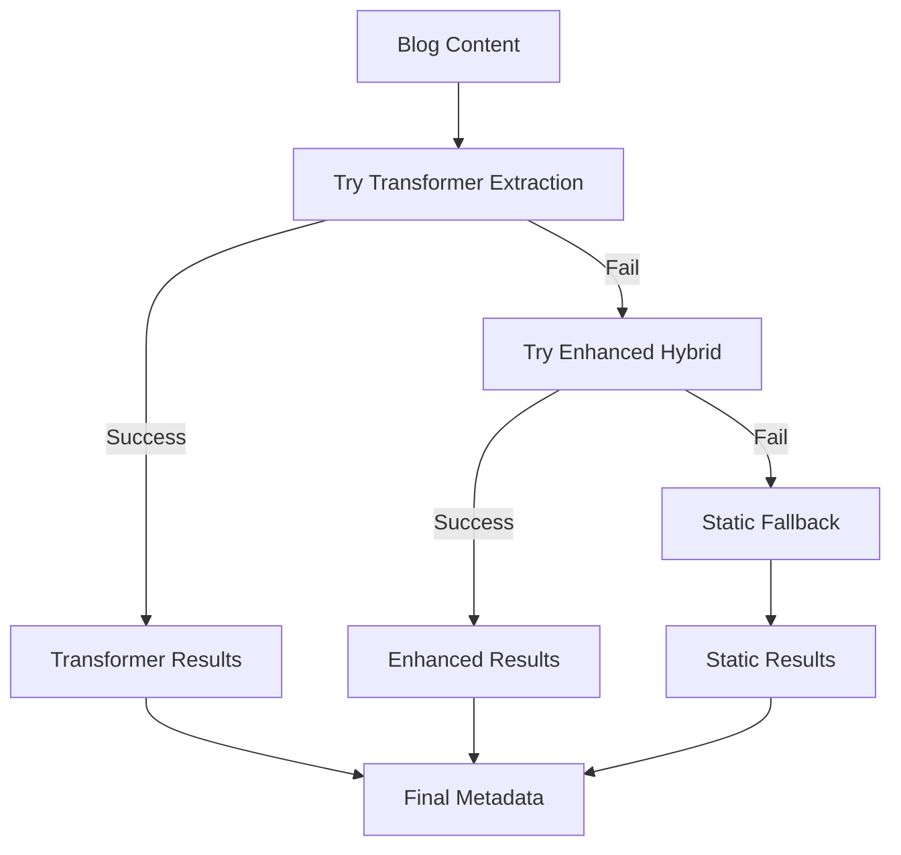

# Complete Topic Extraction System Guide

This comprehensive guide covers the unified transformer-based topic extraction system that combines semantic understanding with traditional classification methods for accurate content categorization.

## Table of Contents

1. [System Overview](#system-overview)
2. [Architecture & Components](#architecture--components)
3. [Update Modes Explained](#update-modes-explained)
4. [Setup & Installation](#setup--installation)
5. [Daily Usage Workflows](#daily-usage-workflows)
6. [CI/CD Integration](#cicd-integration)
7. [Makefile Commands](#makefile-commands)
8. [Troubleshooting](#troubleshooting)
9. [Advanced Configuration](#advanced-configuration)
10. [Performance Optimization](#performance-optimization)

---

## System Overview

### What It Does

The topic extraction system automatically analyzes your blog content and assigns relevant topic classifications using a unified multi-tier approach:

- **🚀 Transformer-Based (Primary)**: Semantic analysis using sentence transformers with the same `all-MiniLM-L6-v2` model as search
- **🔄 Enhanced Hybrid (Fallback)**: Static classification + dynamic ML discovery  
- **📝 Traditional (Final Fallback)**: Rule-based matching using predefined categories
- **🧠 Unified Architecture**: Consistent embeddings across search and topic extraction

### Key Benefits

- **🎯 Semantic Understanding**: Understands context and meaning, not just keywords
- **🔄 Unified Architecture**: Same embeddings for search and topics ensure consistency
- **⚡ Smart Fallbacks**: Three-tier system ensures reliability and performance
- **📈 High Accuracy**: Transformer-based semantic similarity with confidence scoring
- **⚙️ Advanced Options**: BERTopic integration for automatic topic modeling
- **🚀 Fast Updates**: Smart caching and model reuse for quick rebuilds
- **🤖 CI/CD Ready**: Automated integration with build pipelines and dependency caching
- **🛠️ Manual Control**: Override options and multiple extraction modes

---

## Architecture & Components

### File Structure

```plaintext
project-root/
├── .venv/                              # Python virtual environment
├── blog/                               # Blog posts (markdown files)
├── website/
│   ├── config/
│   │   ├── topic-extraction-data.json  # Static topic categories (committed)
│   │   └── topic_models/               # Generated ML models (gitignored)
│   │       ├── transformer_topics.json    # **NEW** Transformer-discovered topics
│   │       ├── category_embeddings.pkl    # **NEW** Pre-computed category embeddings
│   │       ├── discovered_topics.json     # Traditional dynamic topic definitions
│   │       ├── tfidf_vectorizer.pkl       # Trained TF-IDF model (fallback)
│   │       ├── topic_clusters.pkl         # K-means clustering model (fallback)
│   │       └── *_backup_*.json            # Automatic backups
│   ├── scripts/
│   │   ├── transformer_topic_extraction.py # **NEW** Unified transformer-based system
│   │   ├── enhanced_topic_extraction.py    # Enhanced hybrid classification (fallback)
│   │   ├── topic_discovery.py              # Traditional ML topic discovery (fallback)
│   │   ├── create_blog_metadata.py         # Main metadata generator with unified approach
│   │   ├── test_unified_extraction.py      # **NEW** Test suite for all extraction methods
│   │   └── setup_models.py                 # System validation
│   └── public/blogdata/metadata/
│       └── blog_metadata.json         # Enhanced metadata output
├── scripts/
│   ├── setup-topic-extraction.sh      # Complete system setup
│   └── update-blog-metadata.sh        # Smart update script
└── documentation/development/
    └── TOPIC_EXTRACTION_COMPREHENSIVE_GUIDE.md # Complete documentation
```

### Key Components

#### 1. **Static Topic Configuration**

- **File**: `website/config/topic-extraction-data.json`
- **Purpose**: Topic categories, technical entities, and stop words
- **Version Controlled**: Yes (committed to git)
- **Generation**: Can be manually maintained OR dynamically generated from blog content
- **Dynamic Enhancement**: Automatically discovers new technical terms from your actual blog content

#### 2. **Transformer Models & Embeddings**

- **Files**: `website/config/topic_models/category_embeddings.pkl`, `transformer_topics.json`
- **Purpose**: Pre-computed semantic embeddings and transformer-discovered topics
- **Version Controlled**: No (excluded via .gitignore)
- **Auto-Generated**: Created by unified transformer system using `all-MiniLM-L6-v2` model

#### 3. **Traditional ML Models (Fallback)**

- **Files**: `website/config/topic_models/*.pkl` and `discovered_topics.json`
- **Purpose**: TF-IDF vectorizers, K-means clusters, traditional topic discovery
- **Version Controlled**: No (excluded via .gitignore)
- **Auto-Generated**: Created by enhanced topic extraction system as fallback

#### 4. **Enhanced Metadata**

- **File**: `website/public/blogdata/metadata/blog_metadata.json`
- **Purpose**: Complete blog metadata including topic classifications
- **Contains**: Topics, reading time, series data, complexity scores
- **Used By**: Website build process for content organization

### Multi-Tier Extraction System

The unified system uses a three-tier approach for maximum reliability:

#### **🚀 Tier 1: Transformer-Based (Primary)**

- **Model**: `all-MiniLM-L6-v2` sentence transformer (same as search system)
- **Method**: Semantic similarity between content embeddings and pre-computed category embeddings
- **Advantages**: Context-aware, handles synonyms, consistent with search
- **Speed**: Fast (embeddings cached)
- **Accuracy**: Highest for semantic understanding

#### **🔄 Tier 2: Enhanced Hybrid (Fallback)**

- **Method**: Static categories + traditional TF-IDF clustering
- **Advantages**: Explainable, customizable, works without transformers
- **Speed**: Medium (requires TF-IDF computation)
- **Accuracy**: Good for keyword-based content

#### **📝 Tier 3: Static Classification (Final Fallback)**

- **Method**: Rule-based keyword matching
- **Advantages**: Always available, fast, predictable
- **Speed**: Fastest
- **Accuracy**: Basic but reliable

#### **🧠 Extraction Flow**



---

## Update Modes Explained

### 1. **Smart Update (Metadata-Only)**

**Command**: `./scripts/update-blog-metadata.sh --metadata-only`

**What it does:**

- Uses existing topic models if available
- Only regenerates blog metadata
- Fast execution (10-30 seconds)

**When to use:**

- Code changes, styling updates
- Configuration changes
- When you know blog content hasn't changed

**Process:**

```plaintext
1. ✓ Check if topic models exist
2. ✓ Load cached ML models
3. ✓ Parse blog posts and extract metadata
4. ✓ Apply topic classifications using cached models
5. ✓ Generate blog_metadata.json
```

### 2. **Full Discovery (Default Smart Mode)**

**Command**: `./scripts/update-blog-metadata.sh` (no flags)

**What it does:**

- Regenerates topic models when blog content changes
- Reuses cached models when content unchanged
- Balances accuracy with performance

**When to use:**

- Added new blog posts
- Let the system automatically decide
- Normal workflow (recommended default)

**Process:**

```plaintext
1. 🔍 Analyze blog content for changes
2. 🧠 Run ML topic discovery if needed
3. 📊 Generate/update topic models
4. 📝 Apply classifications to all posts
5. 💾 Generate enhanced metadata
```

### 3. **Force Update (Complete Regeneration)**

**Command**: `./scripts/update-blog-metadata.sh --force`

**What it does:**

- Ignores all cached files and existing models
- Completely regenerates everything from scratch
- Slow execution (5-15 minutes for large blogs)

**When to use:**

- Topic classifications seem inaccurate
- Changed topic extraction configuration
- Debugging classification issues
- Monthly maintenance

**Process:**

```plaintext
1. 🗑️ Delete existing topic models
2. 📚 Analyze entire blog corpus with ML
3. 🎯 Run K-means clustering to discover topics
4. 🤖 Train new TF-IDF vectorizer
5. 🏗️ Generate new topic model files
6. ✨ Apply fresh topic classifications
7. 📄 Generate blog_metadata.json
```

### 4. **Discovery-Only Mode**

**Command**: `./scripts/update-blog-metadata.sh --discovery-only`

**What it does:**

- Only runs topic discovery
- Skips metadata generation
- Useful for model updates

**When to use:**

- Want to update topic models without regenerating metadata
- Testing topic discovery parameters
- Preparing models for later use

### 5. **Config Update Mode**

**Command**: `./scripts/update-blog-metadata.sh --update-config`

**What it does:**

- Analyzes blog content to discover technical terms and entities
- Enhances existing topic categories with content-specific keywords
- Generates optimized stop words for your blog
- Updates the static configuration file with discovered terms

**When to use:**

- After adding significant new content with new technologies
- When topic classifications seem incomplete
- Quarterly maintenance to keep config current
- When expanding into new technical areas

### Comparison Table

| Aspect                  | Smart/Metadata-Only | Full Discovery          | Force Update       | Discovery-Only     | Config Update      |
| ----------------------- | ------------------- | ----------------------- | ------------------ | ------------------ | ------------------ |
| **Speed**               | ⚡ Fast (10-30s)     | 🔄 Medium (2-5min)       | 🐌 Slow (5-15min)   | 🔄 Medium (2-5min)  | 🔄 Medium (1-3min)  |
| **Topic Models**        | Uses cached         | Regenerates if needed   | Always regenerates | Always regenerates | No change          |
| **Blog Analysis**       | Skip if cached      | Runs if content changed | Always runs        | Always runs        | Content analysis   |
| **Config Enhancement**  | ❌ No               | ❌ No                   | ❌ No              | ❌ No              | ✅ Yes             |
| **Metadata Generation** | ✅ Yes               | ✅ Yes                   | ✅ Yes              | ❌ No               | ❌ No               |
| **Use Case**            | Minor changes       | New blog posts          | Troubleshooting    | Model updates      | Config maintenance |
| **CI Default**          | ✅ Yes               | Auto-triggered          | Manual only        | Manual only        | Manual only        |

---

## Setup & Installation

### Quick Start

1. **Initial Setup** (one-time):

   ```bash
   ./scripts/setup-topic-extraction.sh
   ```

2. **Regular Updates** (after adding content):

   ```bash
   ./scripts/update-blog-metadata.sh
   ```

### Detailed Setup Process

The setup script performs these steps:

1. **Environment Validation**: Checks Python version and system requirements
2. **Virtual Environment**: Creates/validates Python virtual environment
3. **Dependencies**: Installs transformer packages (sentence-transformers, torch) + traditional ML (scikit-learn, nltk)
4. **Model Downloads**: Downloads sentence transformer models and NLTK data
5. **Directory Structure**: Creates necessary directories
6. **Embedding Generation**: Pre-computes category embeddings for semantic similarity
7. **Topic Discovery**: Analyzes blog corpus with transformer-based clustering (optional: BERTopic)
8. **Metadata Generation**: Creates enhanced metadata with unified topic classifications

### Setup Options

```bash
# Standard setup
./scripts/setup-topic-extraction.sh

# Force complete regeneration
./scripts/setup-topic-extraction.sh --force

# Setup dependencies only (for CI)
./scripts/setup-topic-extraction.sh --skip-discovery

# Custom blog folder
./scripts/setup-topic-extraction.sh --blog-folder /path/to/blog

# Show help
./scripts/setup-topic-extraction.sh --help
```

---

## Daily Usage Workflows

### Content Creator Workflow

1. **Write new blog post**:

   ```bash
   # Create new post
   mkdir -p blog/2025/08/07/my-new-post
   echo "# My New Post" > blog/2025/08/07/my-new-post/readme.md
   ```

2. **Update topics**:

   ```bash
   # Smart update - automatically detects new content
   ./scripts/update-blog-metadata.sh
   ```

3. **Build website**:

   ```bash
   cd website && npm run generate
   ```

### Developer Workflow

1. **Code changes only**:

   ```bash
   # Fast metadata update
   make update-metadata
   ```

2. **Config changes that affect topics**:

   ```bash
   # Force regeneration
   make update-topics-metadata-force
   ```

3. **Testing topic extraction**:

   ```bash
   # Test all extraction methods
   make test-topics
   
   # Test unified transformer system specifically
   cd website && python scripts/test_unified_extraction.py
   ```

### Maintenance Workflow

#### Weekly

```bash
# Let system auto-update
make update-topics-metadata
```

#### Monthly  

```bash
# Force complete regeneration
make update-topics-metadata-force

# Update topic configuration with new terms
make update-topic-config

# Validate system
make test-topics
```

#### When Things Go Wrong

```bash
# Clean and regenerate everything
make clean-topics
make setup-topics-force
```

---

## CI/CD Integration

### Smart CI Behavior

The CI system automatically determines the optimal topic extraction mode:

#### **Automatic Triggers:**

1. **Blog Content Changes**: Auto-detected via git diff

   ```yaml
   # When files in blog/ directory change → Full Discovery
   git diff --name-only ${{ github.event.before }}..${{ github.sha }} | grep "^blog/"
   ```

2. **Missing Models**: No cached topic models → Full Discovery

3. **Scheduled Runs**: Weekly complete refresh → Full Discovery

4. **Default**: No changes detected → Metadata-Only (fast)

#### **Manual Control:**

1. **Commit Message Triggers**:

   ```bash
   git commit -m "Update topic config [full-topics]"    # → Full Discovery
   git commit -m "Fix topic extraction [force-topics]"  # → Force Update
   ```

2. **Workflow Dispatch**: Manual GitHub Actions trigger with mode selection

3. **Pull Requests**: Typically run metadata-only for speed

### CI Caching Strategy

```yaml
# Python Virtual Environment
- uses: actions/cache@v4
  with:
    path: .venv
    key: python-venv-${{ runner.os }}-${{ hashFiles('website/scripts/python-requirements.txt') }}

# NLTK Data Models  
- uses: actions/cache@v4
  with:
    path: ~/nltk_data
    key: nltk-data-${{ runner.os }}-v1

# Topic Models (invalidated when blog content changes)
- uses: actions/cache@v4
  with:
    path: website/config/topic_models
    key: topic-models-${{ runner.os }}-${{ hashFiles('blog/**/*.md') }}
```

### CI Performance Optimizations

- **Smart Mode Selection**: Automatically chooses fastest appropriate mode
- **Intelligent Caching**: Models cached until blog content actually changes
- **Parallel Execution**: Caching operations run concurrently
- **Error Handling**: Graceful fallbacks if ML components fail
- **UTF-8 Support**: Proper encoding for international content

---

## Makefile Commands

### Setup Commands

```bash
make setup-topics         # Initial system setup
make setup-topics-force   # Force complete regeneration
```

### Update Commands

```bash
make update-topics-metadata       # Smart update (default)
make update-metadata              # Fast metadata-only update  
make update-topic-discovery       # Topic discovery only
make update-topics-metadata-force # Force complete regeneration
make update-topic-config          # Update topic config from content analysis
```

### Build Integration

```bash
make build-with-topics     # Build website with updated topics
make generate-with-topics  # Generate static site with updated topics
make dev-with-topics       # Start dev server with updated topics
```

### Utility Commands

```bash
make test-topics    # Validate topic extraction system
make clean-topics   # Clean generated models and backups
make backup-topics  # Create manual backup of models
make help          # Show all available commands
```

### Website Development

```bash
make dev           # Start development server
make build         # Build the application
make generate      # Generate static site
make preview       # Preview the built site
```

---

## Troubleshooting

### Common Issues

#### "Total posts: 0" / No metadata generated

**Cause**: Path issue - script running from wrong directory

**Solution**:

```bash
# Fixed in latest version - script now runs from project root
./scripts/update-blog-metadata.sh
```

**Verification**:

```bash
# Check if blog folder exists and has posts
ls -la blog/
find blog/ -name "*.md" | head -5
```

#### "Virtual environment not found"

**Cause**: Topic extraction system not set up

**Solution**:

```bash
./scripts/setup-topic-extraction.sh
```

#### "Required Python packages not found"  

**Cause**: Dependencies not installed or corrupted

**Solution**:

```bash
# Force reinstall dependencies
./scripts/setup-topic-extraction.sh --force
```

#### "Blog folder not found"

**Cause**: Script can't locate blog directory

**Solution**:

```bash
# Use custom path
./scripts/update-blog-metadata.sh --blog-folder /path/to/blog

# Or ensure you're in project root
pwd  # Should show project root directory
```

#### "Topic discovery failed"

**Cause**: Insufficient content or corrupted models

**Solution**:

```bash
# Ensure you have at least 3 published posts
grep -r "published: true" blog/ | wc -l

# Force regeneration
./scripts/update-blog-metadata.sh --force
```

### Performance Issues

#### **Large Blog Collections (>500 posts)**

**Symptoms**: Topic discovery takes >10 minutes

**Solutions**:

```bash
# Use metadata-only for regular updates  
make update-metadata

# Use discovery-only when you want new topic analysis
make update-topic-discovery

# Schedule force updates less frequently
```

#### **Memory Usage**

**Peak Usage**: ~500MB during topic discovery
**Steady State**: ~50MB for metadata generation

**If experiencing memory issues**:

- Run topic discovery on a machine with more RAM
- Use CI with higher memory allocation
- Process blogs in smaller batches

### Debugging

#### Enable Detailed Logging

**Shell Scripts**:

```bash
export DEBUG=1
./scripts/setup-topic-extraction.sh
```

**Python Components**:

```bash
python website/scripts/setup_models.py --verbose
```

#### Verify System Functionality

```bash
# Test all components
make test-topics

# Manual verification
source .venv/bin/activate
python website/scripts/setup_models.py --action test_system --verbose
```

#### Check Generated Files

```bash
# Verify topic models exist
ls -la website/config/topic_models/

# Check metadata file
ls -la website/public/blogdata/metadata/blog_metadata.json

# View topic discovery results
cat website/config/topic_models/discovered_topics.json | jq '.discoveredTopics | keys'
```

---

## Advanced Configuration

### Dynamic Configuration Generation

The topic extraction system can automatically enhance its configuration by analyzing your blog content:

#### **Automatic Discovery Features:**

1. **Technical Entities**: Extracts programming languages, frameworks, and tools from code blocks
2. **Topic Keywords**: Discovers content-specific terms for existing categories  
3. **Technical Acronyms**: Identifies domain-specific abbreviations and acronyms
4. **Version-Specific Tools**: Recognizes technology versions mentioned in posts
5. **Import Analysis**: Analyzes code imports to identify used libraries

#### **Usage Examples:**

```bash
# Generate enhanced config (creates new file)
python website/scripts/generate_topic_config.py

# Compare what would be enhanced
python website/scripts/generate_topic_config.py --compare

# Replace existing config with enhanced version
./scripts/update-blog-metadata.sh --update-config

# Or using makefile
make update-topic-config
```

#### **What Gets Enhanced:**

**Before (manual config):**
```json
{
  "topicCategories": {
    "artificial-intelligence": ["ai", "machine learning", "neural networks"]
  },
  "technicalEntities": {
    "technologies": ["python", "javascript"]
  }
}
```

**After (enhanced with content analysis):**
```json
{
  "topicCategories": {
    "artificial-intelligence": [
      "ai", "machine learning", "neural networks",
      "transformers", "bert", "gpt", "llm"  // ← Discovered from content
    ]
  },
  "technicalEntities": {
    "technologies": [
      "python", "javascript", 
      "pytorch", "tensorflow", "scikit-learn"  // ← Found in code blocks
    ],
    "frameworks": ["react", "vue", "fastapi"]  // ← Auto-discovered
  }
}
```

### Manual Topic Categories

You can still manually edit `website/config/topic-extraction-data.json` to add custom categories:

```json
{
  "topicCategories": {
    "my-custom-topic": [
      "keyword1",
      "keyword2", 
      "related term"
    ],
    "another-topic": [
      "specific term",
      "domain concept"
    ]
  },
  "technicalEntities": {
    "frameworks": [
      "MyFramework",
      "CustomLibrary"
    ]
  }
}
```

### ML Parameter Tuning

Modify parameters in `website/scripts/topic_discovery.py`:

#### Clustering Parameters

```python
# Adjust clustering parameters
kmeans = KMeans(
    n_clusters=n_clusters,
    random_state=42,
    n_init=10,           # Increase for better convergence
    max_iter=500         # Increase for complex datasets
)
```

#### TF-IDF Parameters

```python  
# Adjust TF-IDF parameters
vectorizer = TfidfVectorizer(
    max_features=5000,   # Increase for larger vocabularies
    min_df=2,           # Minimum document frequency
    max_df=0.8,         # Maximum document frequency  
    ngram_range=(1, 2)  # Include bigrams
)
```

#### Topic Discovery Settings

```python
# Adjust topic discovery parameters
min_posts_for_clustering = 5    # Minimum posts needed
max_clusters = 20              # Maximum number of topics
min_cluster_size = 2           # Minimum posts per topic
```

### Content Complexity Assessment

The system automatically assesses content complexity:

- **Technical Density**: Ratio of technical terms to total words
- **Readability Score**: Based on sentence structure and vocabulary
- **Concept Coverage**: Breadth of topics covered
- **Depth Indicators**: Presence of detailed explanations

### Target Audience Identification

Automatic audience classification:

- **Beginner**: Introductory content with explanations
- **Intermediate**: Assumes some background knowledge
- **Advanced**: Technical deep-dives and specialized content
- **Expert**: Cutting-edge research and professional insights

---

## Performance Optimization

### Caching Strategy

#### **Local Development**

```bash
# Models cached until blog content changes
website/config/topic_models/

# Automatic backups prevent data loss
*_backup_*.json files
```

#### **CI/CD Environment**

```yaml
# Three-level caching strategy
1. Python Virtual Environment (by requirements hash)
2. NLTK Data Models (persistent)
3. Topic Models (by blog content hash)
```

### Build Time Optimization

#### **Development Builds**

- Use `--metadata-only` for code changes
- Full discovery only when adding content
- Smart detection minimizes unnecessary work

#### **Production Builds**  

- CI automatically selects optimal mode
- Cached models used when possible
- Weekly scheduled refresh ensures accuracy

### Resource Usage

#### **Disk Space**

- **Dependencies**: ~200MB (Python packages + NLTK data)
- **Models**: ~10-50MB (varies by blog size)
- **Backups**: Automatic cleanup of old backups

#### **Memory Requirements**

- **Setup**: ~500MB peak during topic discovery
- **Updates**: ~50MB for metadata generation
- **CI**: Suitable for standard GitHub Actions runners

#### **CPU Usage**

- **Topic Discovery**: CPU-intensive (2-5 minutes)
- **Metadata Generation**: Light processing (10-30 seconds)
- **Smart Mode**: Minimal processing when using cached models

### Scaling Considerations

#### **Large Blog Collections**

**>100 posts**: Standard performance
**>500 posts**: Consider metadata-only for regular updates
**>1000 posts**: May need specialized CI runners for topic discovery

**Optimization strategies**:

- Use incremental updates where possible
- Schedule full discovery during off-peak hours
- Consider distributed processing for very large collections

---

## System Requirements

### Dependencies

- **Python**: 3.8+ (3.12+ recommended)
- **Virtual Environment**: Automatically managed
- **Disk Space**: ~200MB for all dependencies and models
- **Memory**: ~500MB during topic discovery, ~50MB steady state

### Python Packages

Automatically installed via `website/scripts/python-requirements.txt`:

#### **Transformer Dependencies (Primary)**
- `sentence-transformers>=2.2.2` - Semantic embeddings (same model as search)
- `torch>=2.0.0` - PyTorch backend for transformers
- `transformers>=4.21.0` - Hugging Face transformers library

#### **Advanced Topic Modeling (Optional)**
- `bertopic>=0.15.0` - Advanced transformer-based topic discovery
- `umap-learn>=0.5.0` - Dimensionality reduction for BERTopic
- `hdbscan>=0.8.0` - Hierarchical clustering for BERTopic

#### **Traditional ML (Fallback)**
- `scikit-learn>=1.3.0` - Traditional machine learning algorithms
- `nltk>=3.8` - Natural language processing and tokenization
- `numpy>=1.24.0` - Numerical operations  
- `scipy>=1.10.0` - Sparse matrix operations

#### **Content Processing**
- `python-frontmatter` - Markdown parsing with frontmatter
- `python-dateutil` - Date parsing and manipulation
- `PyYAML` - YAML configuration files

### System Compatibility

- **Linux**: Full support (recommended)
- **macOS**: Full support
- **Windows**: Supported with WSL
- **CI/CD**: GitHub Actions, CircleCI, Jenkins

---

## Backup and Recovery

### Automatic Backups

The system automatically creates backups:

```bash
# Topic models
website/config/topic_models/discovered_topics_backup_YYYYMMDD_HHMMSS.json

# Blog metadata  
website/public/blogdata/metadata/blog_metadata_backup_YYYYMMDD_HHMMSS.json
```

### Manual Backup

```bash
# Create manual backup
make backup-topics

# Or use script directly
./scripts/update-blog-metadata.sh  # Automatically creates backups
```

### Recovery Process

```bash
# Restore from backup
cp website/config/topic_models/discovered_topics_backup_20250101_120000.json \
   website/config/topic_models/discovered_topics.json

# Restore metadata
cp website/public/blogdata/metadata/blog_metadata_backup_20250101_120000.json \
   website/public/blogdata/metadata/blog_metadata.json

# Or regenerate everything
make setup-topics-force
```

---

## Integration Examples

### GitHub Actions Integration

```yaml
# Basic integration
- name: Update Topics and Build
  run: |
    ./scripts/update-blog-metadata.sh
    cd website && npm run generate

# Advanced integration with mode selection
- name: Smart Topic Update
  run: |
    if [[ "${{ github.event.head_commit.message }}" == *"[force-topics]"* ]]; then
      ./scripts/update-blog-metadata.sh --force
    elif git diff --name-only ${{ github.event.before }}..${{ github.sha }} | grep -q "^blog/"; then
      ./scripts/update-blog-metadata.sh
    else
      ./scripts/update-blog-metadata.sh --metadata-only
    fi
```

### Local Development Integration

```json
{
  "scripts": {
    "update-topics": "../scripts/update-blog-metadata.sh",
    "update-topics-fast": "../scripts/update-blog-metadata.sh --metadata-only",
    "dev-with-topics": "../scripts/update-blog-metadata.sh --metadata-only && npm run dev",
    "build-with-topics": "../scripts/update-blog-metadata.sh && npm run generate"
  }
}
```

### IDE Integration

#### VS Code Tasks

```json
{
  "version": "2.0.0",
  "tasks": [
    {
      "label": "Update Blog Topics",
      "type": "shell", 
      "command": "./scripts/update-blog-metadata.sh",
      "group": "build",
      "presentation": {
        "echo": true,
        "reveal": "always"
      }
    }
  ]
}
```

---

This comprehensive guide covers all aspects of the topic extraction system from setup to advanced usage. For questions or issues, refer to the troubleshooting section or check the system logs for detailed error messages.
