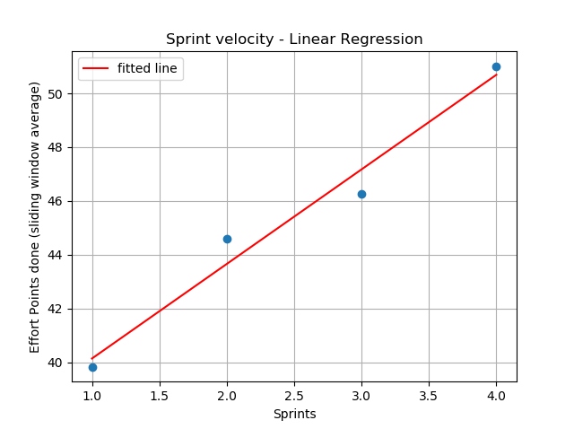
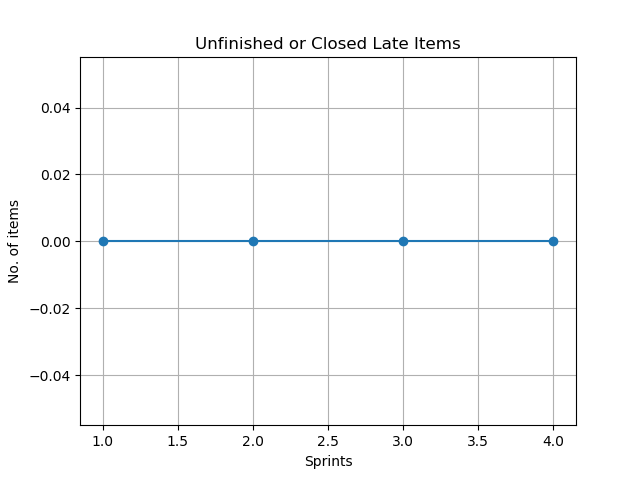

# Measuring Productivity and Performance of Software Engineering Teams

${toc}

A key facet of running software engineering teams is being able to measure team productivity and performance over time. This allows for gauging how a team is doing and whether any course correction is needed. It is also a means for measuring effectiveness of the Engineering Manager.

The first step for measuring performance is to establish key performance indicators (KPI), or productivity metrics. If the team already uses an Agile development process, that can help in figuring out these metrics. In my teams, I like to use the following KPIs.

## Metrics

### Sprint Velocity

This is the total effort points done as part of the sprint. The key here is that we should only take into account effort points for sprint backlog items that have been explicitly marked as "Done" (or Completed), before the end of the sprint. There can be three ways of measuring sprint velocity.

1. Absolute - This is the absolutely value of the sum of effort points for all "Done" sprint backlog items.
2. Average value
   1. Establish an upper and lower bound for sprints that would be used to make this calculation. The limits could very encompass every single sprint.
   2. Find the absolute value of the sum of effort points for all "Done" sprint backlog items for each sprint within the established limits.
   3. Sum up all the absolute values from previous step.
   4. Divide the sum from previous step by the number of sprints within the established limits.
3. Sliding window average - As the name suggests, this is also an average measurement of a certain window size, but the calculation is based on a sliding window algorithm. The sliding window average has the advantage of minimizing any potential variability from:
   1. Team members taking time-off, extended or otherwise, planned or unplanned.
   2. Unforeseen and/or out-of-control impediments.

### Unfinished or Closed Late items

This is the number of sprint backlog items that are either not completed, or closed out after the sprint end date. This metric is a measure of:

1. **Sprint planning effectiveness**. Value of 0 implies 100% effectiveness, i.e., all planned items were completed.
2. **Percentage of committed items completed**. Value of 0 indicates 100% of committed items were completed.
3. **Items rolled over to next sprint**. Value of 0 implies 0.

### Sprint Velocity Trend

This metrics has two measurements. For both of them, positive number indicates increasing sprint velocity over time. Larger the number better the performance.

#### Linear Regression Slope

Linear regression analysis is done over the project data.

#### Average Delta Change per Sprint (in percentage)

This is a calculated value over the project data.

If the number of developers in the team is constant over time, I do not believe it is realistic to have a positive average delta change per sprint forever. That would basically indicate that a team will double their velocity every _n_ sprints given a constant number of developers. I think it can be expected that a team might have a factor of magnitude increase in Sprint Velocity as they reach the upper limit of their performance threshold for a certain number of developers. It is however important that once that threshold is reached, there is no downwards trend. In other words, it is reasonable to expect that the slope of the linear regression analysis should be positive. The only exception to this rule may be a scenario where the end-points for the linear regression analysis end up including sprints where there were serious unforeseen impediments such as developer attrition, unplanned time-off, etc.

## Methodology

I use Python to query the [analytics service](https://docs.microsoft.com/en-us/azure/devops/report/extend-analytics/?view=azure-devops) of the project data using their OData based API. The returned JSON data is also mined and plotted using Python. Some sample plots are provided here.

## Individual Team Member Performance

This same or similar methodology can also be applied for measuring individual developer performance. Specifically, effort points done by a software engineer over time should translate into a positive slope when linear regression is applied. If for some reason, for a certain time-bound block, the slope is negative, it should be up to the Engineering Manager to determine course correction.

I will however caution that while it may be very tempting to use this sort of analysis to do relative ranking between software engineers within a team, that is generally not good practice. I believe stack (or relative) ranking leads to a toxic work environment. One of the values I establish in teams I run, is "Teamwork". Stack ranking is fundamentally antithetical to teamwork. This matter however warrants a separate blog post in itself, so we will discuss it some other time.

## Estimation

Analyzing team productivity also has the added advantage of leading to better estimation. So, it becomes a fairly easy task to provide ETA's to stakeholders. This process can also be used, as I do, for driving workload planning and estimation for not just sprints, for also for features, epics and even programs.

## Goals as Performance Measurement

All team members should also have yearly and quarterly goals. These goals should ideally map to larger team and org goals. Needless to say, having quantifiable goals using mechanisms like [OKR](https://en.wikipedia.org/wiki/OKR) can also help in measuring performance.

## Summary

Using a data-driven methodology for measuring performance of software engineering teams drives productivity and helps in better estimation of workloads and timelines. Indeed, measuring team performance and productivity is key for running engineering teams effectively and efficiently.
