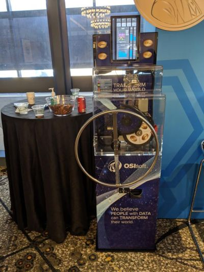
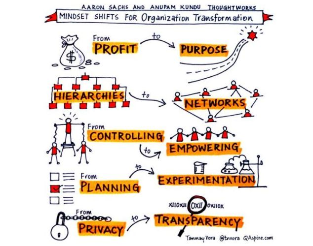
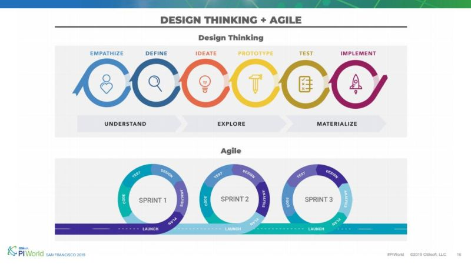

**Note**: This is a personal post and has absolutely nothing to do with my employer OSIsoft.

# Brief Summary of PI World 2019

${toc}

I was at PI World 2019 in San Francisco this week. It was hectic, but also quite interesting seeing the industrial software domain veer towards cloud and edge. Talking to customers, it was quite apparent that there is a decided excitement about OSIsoft's edge solutions in particular, specifically the Edge Data Store. The slick [demo at the keynote](https://www.osisoft.com/Presentations/Engineering-Roadmap-4x/) using the SLTC data and the conference room monitoring generated lot of interest and there were customers who specifically came by the Edge Technologies booth at the expo driven by the demo. The Penny Press demo at the Edge booth was quite a hit and I could see long lines forming more than a few times.

<!---->

Talking to some of my colleagues who were manning the cloud booth, it appears that many customers who some years back may have been little wary about letting their operational data be in the cloud, have come around to it and now were looking forward to leveraging OSIsoft Cloud Services. There was also some buzz generated by the startup Petuum with their AI and ML based solutions. Indeed, in informal conversations with some customers during the evening events, there were quite a few who expressed interest in using AI and ML to gain insight into their operational data, including being able to do drive prediction and automation using these technologies. OSIsoft Cloud Services' ongoing work for enabling data science using data views ties into this area quite well.

## Bill Johnson Keynote - Enabling Business Transformation with the PI System

One of the [keynotes](https://www.osisoft.com/Presentations/DCP-Midstream---Enabling-Business-Transformation-with-the-PI-System--The-DCP-2-0-Journey-1x/) by Bill Johnson from DCP Midstream was about a transformational journey to an agile development process for a company in the industrial operations domain - moving to scrum, design thinking, fast development cycles, using chat based messaging instead of email, etc. One customer I spoke to during the conference specifically mentioned that he was going to try and adopt some of the points from the keynote at this workplace to drive transformation into leaner and faster turnaround. I recommend watching the recording.

<!---->

<!---->

## Mark Jeffries Keynote - The Art of Business Influence

I enjoyed the [keynote by Mark Jeffries](https://www.osisoft.com/Presentations/Keynote-Presentation--The-Art-of-Business-Influence--Mark-Jeffries/) in "The Art of Business Influence". His talk was perhaps geared towards sales and marketing folks, but I thought there were points applicable to pretty much anyone, be it in their personal or professional lives. His talk drew material from the fields of evolutionary and behavioral psychology. Some of the main points from his presentation are captured below.

Each person has three jobs:

1. Head of Sales
2. Director of Translation
3. Chief Story-teller.

LWAR

- Listen
- Watch
- Anticipate
- Respond

Brains

- Bridging - jealousy effect.
- Rationalizing - can you solve my problem.
- Asserting - but not aggressive. As long as in best interest of parties involved.
- Inspiring - want to know about outcome.
- Negotiating - understanding what person in front wants and offering it even before they say it.
- Specializing - broadcast, not brag, ability. Consistency, clarity, confidence.

People listen with the intent to respond, not understand.

## Edge Solutions from OSIsoft

I recommend watching the talk on [Edge Analytics](https://www.osisoft.com/Presentations/Edge-Analytics-with-the-PI-System--EDSx--OSIsoftx/) for an overview of the Edge Data Store and its capabilities. I worked on this project for the last year and and a half, indeed, I helped bootstrap the team, so I have a vested interest in following its trajectory and success.

## OSIsoft Cloud Services (OCS)

I recommend watching the following talks:

- An [overview of OCS](https://www.osisoft.com/Presentations/Cloud-Services/).
- Lonnie Bowling on building a [real-time weather application](https://www.osisoft.com/Presentations/Just-Another-Weather-Application-–-Evaluating-the-OSIsoft-Cloud-Services--Diemusx/) using OCS.
- A fairly detailed [technical walkthrough](https://www.osisoft.com/Presentations/OSIsoft-Cloud-Services-for-Developers/) of the capabilities of OCS.
- Doing [data science for PI data by leveraging OCS](https://www.osisoft.com/Presentations/Cloud-based-Data-Science-Enablement-for-the-PI-System--OSIsoftx/).

Some years back I was one one of the founding members of what was at that time known as Qi, and what has since become known as OSIsoft Cloud Services, so the success of this product is dear to me. As it happens I am now back to the OCS ecosystem managing the team responsible for Context and metadata, so it is good to be back to what I had helped kick-off.

<!---->
