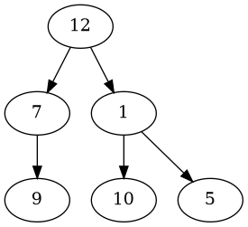
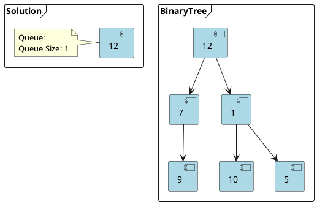
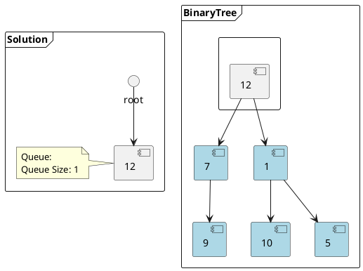
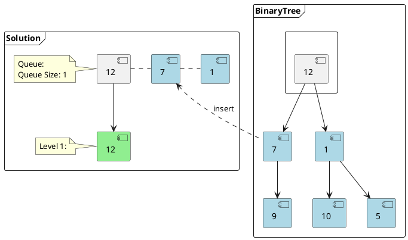
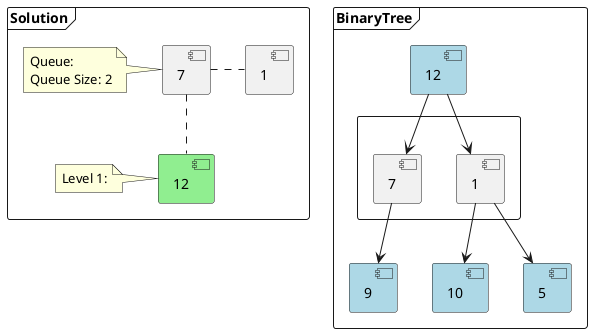
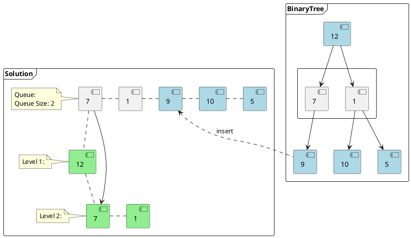
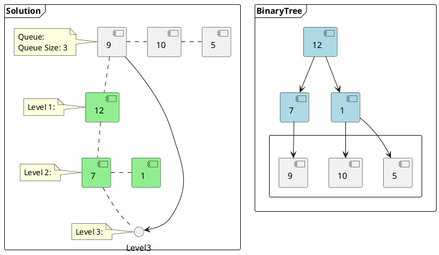

# Breadth First Search Algorithm for Level Order Traversal of a Binary Tree

${toc}

Breadth First Search (BFS) is a traversal/search algorithm for trees and graphs. We will use the example of a binary tree. The level order traversal problem for a binary tree is a good way to understand this algorithm.

## Algorithm

Let us consider the following example:



For this binary tree we are expected to return a nested array as follows:

```text
Level Order Traversal:  
    [[12],
    [7,1],
    [9,10,5]]
```

Each array within the nested array represents the values of each node at that level.

We can use a **Queue** to efficiently traverse using BFS. In general, BFS problems involve the usage of a queue data structure.

Here are the steps of our algorithm:

1. Push the `root` node to the queue.
2. Keep iterating until the queue is empty.
3. In each iteration, do the following:
   1. Count the number of items in the queue (let’s call it `queueSize`). This represents the number of nodes at that level.
   2. Use an internal array to keep track of the items at each level. Lets calls it `currentLevel`.
   3. For each item in the queue (i.e., for `queueSize` iterations) do the following:
      1. Remove node from the queue.
      2. Push its `value` into the `currentLevel` array.
      3. Insert both of its children into the queue, if exists.
   4. Add `currentLevel` into the final result array that will contain the list of arrays representing the nodes at each level of the tree.
   5. If the queue is not empty, repeat from step 3 for the next level.

This algorithm can be better understood using the visual representation below.



**Step 1 of 7:** Start by pushing the root to the queue.



**Step 2 of 7:** Count the items of the queue (queueSize = 1). They are all in the first level. Since the queueSize is "1" there will be one item in the first level.



**Step 3 of 7:** Move the "one" item to the the output array representing the first level of the tree and push its children to the queue.



**Step 4 of 7:** Count the items of the queue (queueSize = 2). They are all in the second level. Since the queueSize is "2" there will be two items in the second level.



**Step 5 of 7:** Move the "two" items to the the output array representing the second level and push their children to the queue in the same order.



**Step 6 of 7:** Count the items of the queue (queueSize = 3). They are all in the third level. Since the queueSize is "3" there will be three items in the third level.

```plantuml
@startuml
frame "Solution" {
    note left of () Queue
    Queue:
    Queue Size: 3
    end note
    component 12_2 #lightgreen [
        12
    ]
    component 7_2 #lightgreen [
        7
    ]
    component 1_2 #lightgreen [
        1
    ]
    component 9_2 #lightgreen [
        9
    ]
    component 10_2 #lightgreen [
        10
    ]
    component 5_2 #lightgreen [
        5
    ]
    note left of 12_2
    Level 1:
    end note
    7_2 . 1_2
    9_2 . 10_2
    10_2 . 5_2
    () Queue .. 12_2
    12_2 .. 7_2
    7_2 .. 9_2
    note left of 7_2
    Level 2:
    end note
    note left of 9_2
    Level 3:
    end note
}

frame "BinaryTree" {
    [12] --> [7]
    [12] --> [1]
    rectangle " " {
        component [9]
        component [10]
        component [5]
    }
    [7] --> [9]
    [1] --> [10]
    [1] --> [5]
    component [12] #lightblue
    component [7] #lightblue
    component [1] #lightblue
}
@enduml
```

**Step 7 of 7:** Move the "three" items to the the output array representing third level.

### Code Sample

```java
class TreeNode {
  int val;
  TreeNode left;
  TreeNode right;

  TreeNode(int x) {
      val = x;
  }
}
```

```java
public static List<List<Integer>> traverse(TreeNode root) {
    List<List<Integer>> result = new ArrayList<List<Integer>>();
    if (root == null) {
        return result;
    }

    Queue<TreeNode> queue = new LinkedList<>();
    queue.offer(root);
    while (!queue.isEmpty()) {
        int queueSize = queue.size();
        List<Integer> currentLevel = new ArrayList<>();
        for (int i = 0; i < queueSize; i++) {
            TreeNode currentNode = queue.poll();
            currentLevel.add(currentNode.val);
            if (currentNode.left != null) {
                queue.offer(currentNode.left);
            }
            if (currentNode.right != null) {
                queue.offer(currentNode.right);
            }
        }
        result.add(currentLevel);
    }

    return result;
}
```

### Time Complexity

The time complexity of the BFS algorithm is O(N), where N is the total number of nodes in the tree. This is since we traverse each node once.

### Space Complexity

The space complexity of the BFS algorithm is O(N), where N is the total number of nodes in the tree.

- We need to return a list containing the nested arrays representing the nodes at each level.
- We need to take into account the space for the queue data structure. Since we can have a maximum of N/2 nodes at any level therefore we will need O(N) space to store them in the queue.

## References and Further Reading

1. [Breadth-first Search - Wikipedia](https://en.wikipedia.org/wiki/Breadth-first_search)
2. [Level Order Traversal of a Binary Tree (level by level and as a whole) - Vivekanand Khyade - Algorithm Every Day](https://www.youtube.com/watch?v=NjdOhYKjFrU)
